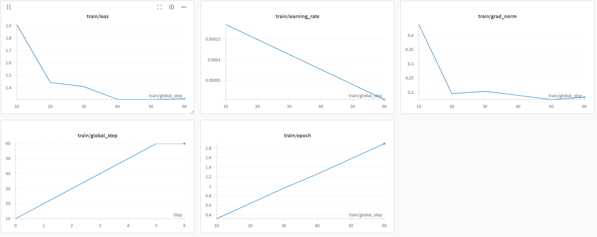
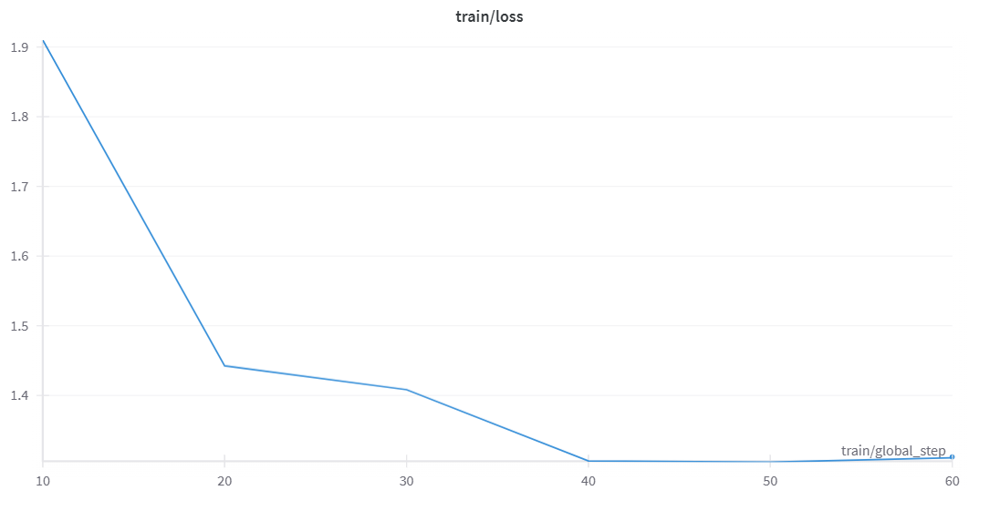

# DeepSeek-R1-Medical-COT

This project fine-tunes the [DeepSeek-R1-Distill-Llama-8B](https://huggingface.co/deepseek-ai/DeepSeek-R1-Distill-Llama-8B) model using a **medical chain-of-thought (CoT)** dataset for clinical reasoning. Training is performed using the [Unsloth](https://github.com/unslothai/unsloth) framework on **Kaggle T4 GPU**, optimized with 4-bit quantization and parameter-efficient LoRA adapters.

---

## 🎯 Objective

To train a reasoning model that can:
- Interpret medical questions
- Think step-by-step using `<think>...</think>` tags
- Produce logical, expert-level responses

---

## 🧠 Dataset

- **Source:** [`FreedomIntelligence/medical-o1-reasoning-SFT`](https://huggingface.co/datasets/FreedomIntelligence/medical-o1-reasoning-SFT)
- **Subset Used:** First 500 samples
- **Fields Used:**
  - `Question`: Medical case scenario
  - `Complex_CoT`: Step-by-step reasoning
  - `Response`: Final answer

---

## 🧪 Prompt Format

A custom prompt structure was used to guide the model into thinking step-by-step before giving an answer.

```text
Below is an instruction that describes a task, paired with an input that provides further context. 
Write a response that appropriately completes the request. 
Before answering, think carefully about the question and create a step-by-step chain of thoughts to ensure a logical and accurate response.

### Instruction:
You are a medical expert with advanced knowledge in clinical reasoning, diagnostics, and treatment planning. 
Please answer the following medical question. 

### Question:
{Question}

### Response:
<think>
{Complex_CoT}
</think>
{Response}
```
## ⚙️ Training Configuration
| Parameter                     | Value | Reason                                      |
| ----------------------------- | ----- | ------------------------------------------- |
| `LoRA r`                      | 16    | Standard rank size for efficient adaptation |
| `lora_alpha`                  | 16    | Scales low-rank updates                     |
| `train_batch_size`            | 2     | Fits into Kaggle T4 memory                  |
| `gradient_accumulation_steps` | 4     | Effective batch size = 8                    |
| `learning_rate`               | 2e-4  | Optimized for PEFT and small dataset        |
| `max_steps`                   | 60    | Sufficient for 500-sample dataset           |
| `max_seq_length`              | 2048  | Long enough for question + CoT + answer     |


- Trainable Parameters: 41.94M

- Total Parameters: 8072.20M

- % Trainable: 0.52%

## 📈 Example Comparison (Before vs After Fine-Tuning)

#### ✅Question

> A 61-year-old woman with a long history of involuntary urine loss during activities like coughing or sneezing but no leakage at night undergoes a gynecological exam and Q-tip test. Based on these findings, what would cystometry most likely reveal about her residual volume and detrusor contractions?


#### ❌ Before Fine-Tuning
```text
<think>
... lengthy, indirect reasoning ...
</think>
Answer: Normal residual volume, weak detrusor contractions.

```

#### ✅ After Fine-Tuning
```text
<think>
Okay, let's see. We have a 61-year-old woman who has been dealing with this annoying urinary issue for a while...
The Q-tip test suggests urethral sphincter deficiency...
We’d expect the cystometry to show increased residual volume and possibly some abnormal detrusor contractions.
</think>

Based on the findings from the Q-tip test, the cystometry would most likely reveal an increased residual volume and possibly abnormal detrusor contractions. This indicates impaired sphincter function, which aligns with the clinical presentation of involuntary urine loss during activities like coughing or sneezing.

```

## 📂 Output Files
All outputs are saved in the `DeepSeek-R1-Medical-COT/` folder:
| File                        | Description                     |
| --------------------------- | ------------------------------- |
| `adapter_model.safetensors` | Fine-tuned LoRA adapter weights |
| `adapter_config.json`       | LoRA configuration              |
| `tokenizer.json`            | Tokenizer vocabulary            |
| `tokenizer_config.json`     | Tokenizer settings              |
| `special_tokens_map.json`   | Special token mappings          |
| `chat_template.jinja`       | Prompt formatting template      |


## 📊 Training Metrics

#### Training was tracked using Weights & Biases (wandb):
> 


Training completed in ~44 minutes on Kaggle’s free T4 GPU. The training loss showed consistent downward trends.

## 🧑‍💻 Author
Developed by: [Prathamesh Pawar](https://github.com/Prathameshppawar)

License: Apache-2.0

## 📝 Notes

- Model is fine-tuned and stored locally only

- No public upload to Hugging Face
